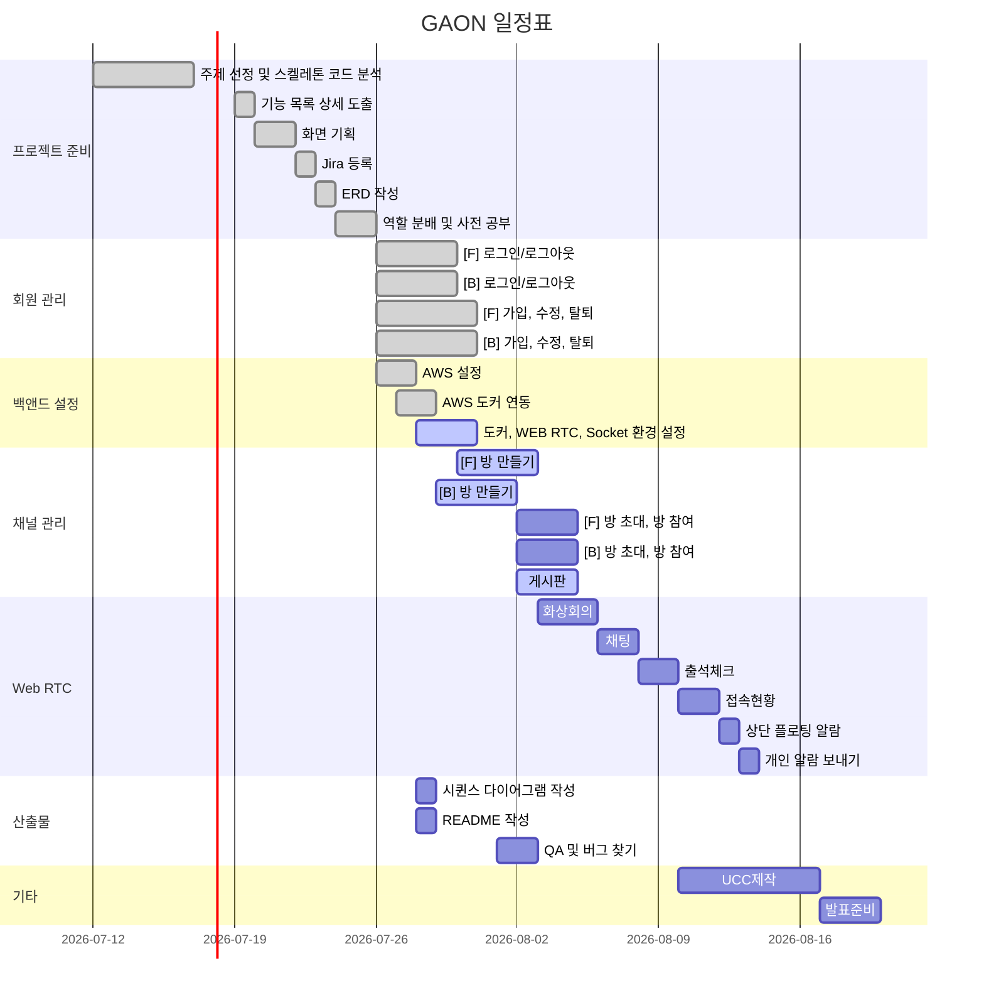

# 프로젝트 명

## 일정표

## ERD 

 

## 목차

- [프로젝트 소개](#프로젝트-소개)   
- [텍스트 ... ](#프로젝트-소개)   
- [프로젝트 명세](#프로젝트-명세)
  - [배포 환경](#배포-환경)
  - [개발 환경](#개발-환경)
  - [Design Resources](#design-resources)
  - [핵심 라이브러리](#핵심-라이브러리)
 

## 프로젝트 소개
소개 입력
 

## 프로젝트 명세
### 배포 환경
- __URL__ : 
- __배포 여부__ : O / X
- __접속 가능__ : 접속 가능 / 수정 중
- __HTTPS 적용__ : O / X
- __PORT__ : // 3rd Party에서 사용하는 포트가 있다면 기입해주세요. <- 기입 후 해당 주석 삭제
 

### 개발 환경
#### Front-end / Android
- __Framework__ : Vue.js / React / Android / Unity
- __지원 환경__ : Web / Mobile / Web App / Native App
- __담당자__ : 팀원 A, 팀원 B,
 

#### Back-end
- __Framework__ : Spring boot / Node.js / Django / Flask
- __Database__ : MySQL / MariaDB
- __담당자__ : 팀원 A, 팀원 B,
 

#### Design
- __Framework 사용__ : O / X
  - [Vuetify](https://vuetifyjs.com/)
  - [Element Plus](https://element-plus.org/)
- __Design Tool 사용__ : Adobe XD, Photoshop, Blender, Zeplin 등 (없을 경우 빈칸)
- __담당자__ : 팀원 A, 팀원 B,
 

### Design Resources
__외부 템플릿 또는 에셋__ (이미지 또는 링크 첨부)
- 무료 이미지, 아이콘, 폰트 등은 제외
- [Vue Argon Design System](https://www.creative-tim.com/product/vue-argon-design-system?affiliate_id=116187) (무료)
  - __사용 기능__ : 디자인 전반 적용
- [Vue Black Dashboard Pro](https://www.creative-tim.com/product/vue-black-dashboard-pro?affiliate_id=116187) (유료)
  - __사용 기능__ : 캘린더 컴포넌트 사용
 

__자체 제작 산출물__ (필요시 이미지 또는 설명 첨부)
- LOGO
- CardView
- Button
- Calendar
 

### 핵심 라이브러리
기본 제공하는 라이브러리 외 핵심 기능 구현에 사용한 라이브러리가 있다면 작성해주세요.   
예시 ) VR/AR 라이브러리, 애니메이션 라이브러리, 텍스트/사진/동영상 지원, 편집 라이브러리 등

- __AR CORE__
  - __링크__ : https://developers.google.com/ar
  - __소개__ : 구글에서 제공하는 AR 지원 라이브러리
  - __사용 기능__ : 이미지 인식, 이미지 위 영상 표시
  - __담당자__ : 팀원 A, 

- __COLOR THIEF__
  - __링크__ : https://lokeshdhakar.com/projects/color-thief/
  - __소개__ : 이미지에서 색상을 추출해주는 라이브러리
  - __사용 기능__ : 커버 사진에서 색상 추출 -> 배경 색상 변경
  - __담당자__ : 팀원 A,

- __Animate.css__
  - __링크__ : https://animate.style/
  - __소개__ : css 애니메이션 지원 라이브러리
  - __사용 기능__ : 메인 페이지 진입 시 애니메이션 사용
  - __담당자__ : 팀원 A,,

